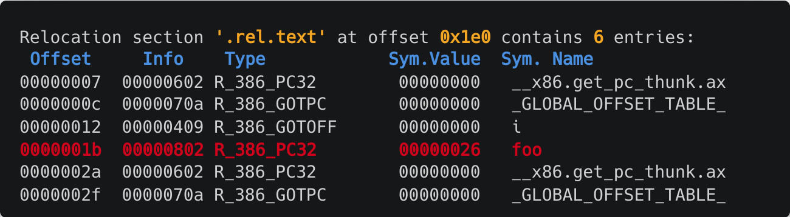
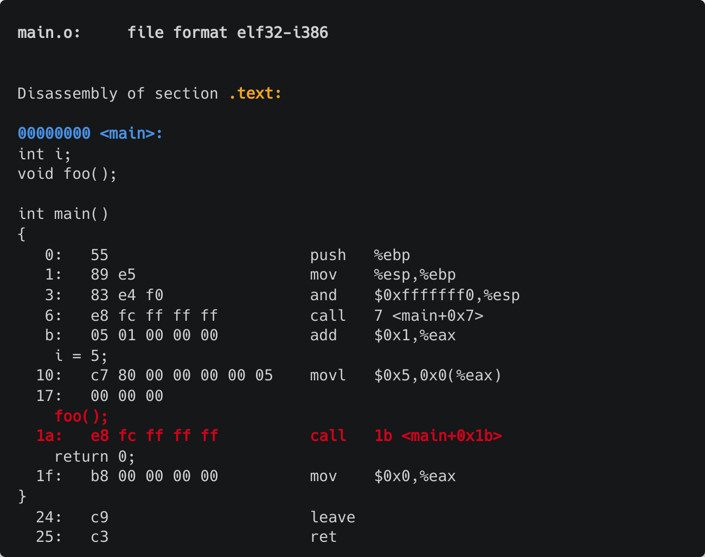
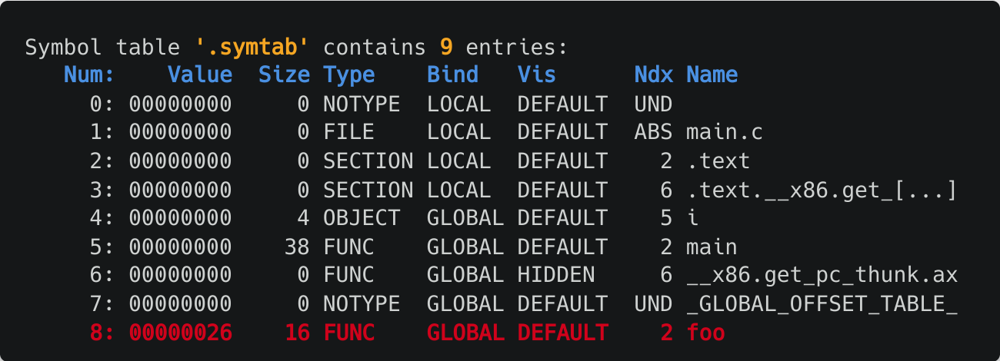
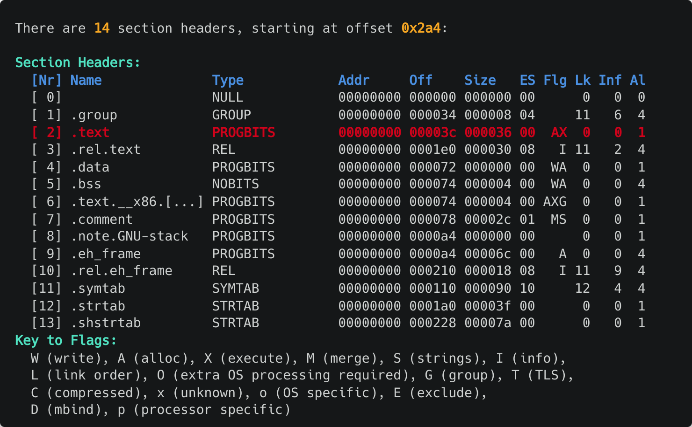
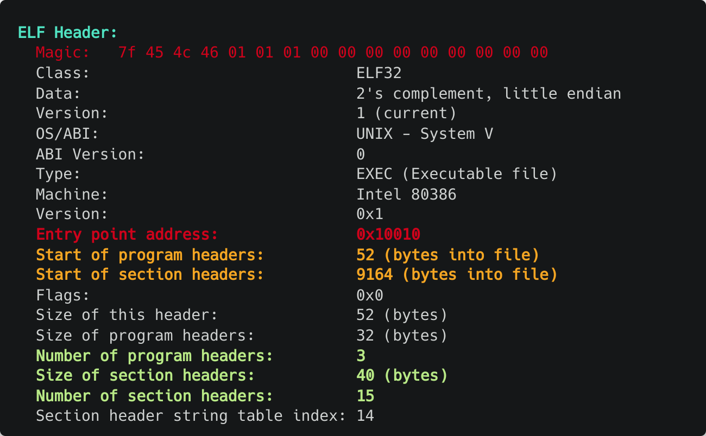
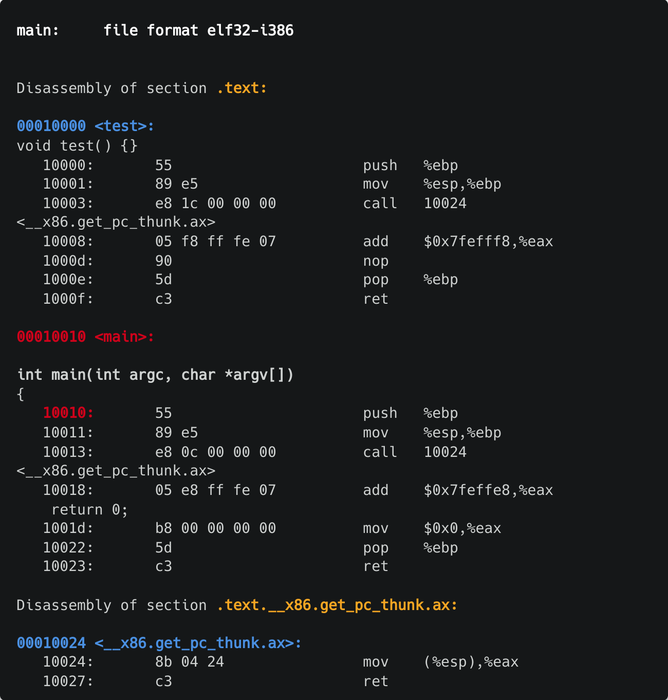
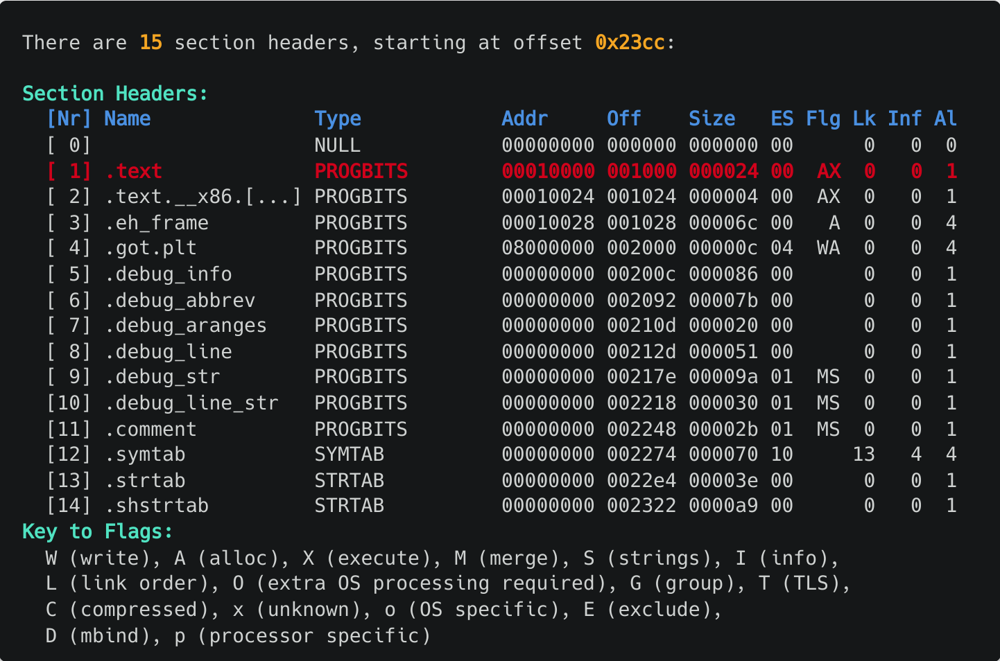

# Relocation and ELFs

## Relocation

Relocation is the process of moving symbols around in the final binary. If a symbol is defined in another file, the linker will need to know where to find it. This is done by adding a relocation entry to the binary. The relocation entry will contain the symbol name and the offset to the symbol. The linker will then use this information to update the symbol offset in the binary.

Consider the following C source file.

```c
int i;
void foo();

int main()
{
    i = 5;
    foo();
    return 0;
}

void foo() {}
```

If we do `readelf -r` on the compiled binary, we can see the relocation entries. For example, relocation entries will look like this:



`Offset` represents the offset in the binary where the relocation entry is located. *An offset is the location into a section of a binary file, where the actual memory address of a symbol definition is replaced*. e.g. in the above example, the function `foo` has an offset of `0x1b` in the `.text` section. Doing `objdump -S` on the binary will show us:



The highlighted line corresponds to the call to `foo` and the address provided to `call` is `0x1b` which is the offset in the `.text` section where the relocation entry is located.

`Info` is a combination of the symbol index and the relocation type. In this case, the `Info` value is `0x0802` where `0x08` is the symbol index and `0x02` is the relocation type. The symbol index is the index of the symbol in the symbol table. The relocation type is the type of relocation. For example, `0x02` is `R_386_PC32` which is a 32-bit PC-relative relocation. This means that the relocation is relative to the program counter. With the type `R_386_PC32`, the following formula is applied for relocation (Inteli386 psABI):

``Relocated Offset = S + A − P``

`Type` is the relocation type. `Sym.Value` is the value of the symbol. `Sym.Name` is the name of the symbol.

Using the command `readelf -s` we can see the symbol table:



From the `Info` of the symbol `foo` we found that the symbol index for `foo` was `0x08` which is `8` in decimal. We can see that the symbol `foo` is at index `8` in the symbol table. The symbol table contains the name of the symbol, the value of the symbol, the size of the symbol, the symbol binding, the symbol type, the section header index, and other information.

If the symbol `Ndx` is `COM` it specifies an unitialized variable.

A symbol whose `Ndx` identifies a specific section, its symbol value holds a section offset. In this case, `main` and `foo` belong to section offset `2`. Let's see what that section offset refers to. We can extract all the section headers with their offsets using `readelf -S` command:



In this case, section header with offset `2` is the `.text` section where all the program code and read only data resides. The symbol value of `main` and `foo` is the offset in the `.text` section where the symbol is located.

### Summary of commands

- `readelf -r` - Shows the relocation entries
- `readelf -s` - Shows the symbol table
- `readelf -S` - Shows the section headers
- `objdump -S` - Shows the assembly code with source code (if debug symbols are present)
- `objdump -d` - Shows the disassembly
- `objdump -t` - Shows the symbol table
- `objdump -R` - Shows the relocation entries

### Side note on Linker scripts

Linker scripts are used to specify the layout of the final binary. The linker script is passed to the linker using the `-T` option. For example, `ld -T linker.ld -o binary.o object1.o object2.o`. The linker script is a text file that contains a series of commands with the following format:

```c
COMMAND
{
    sub-command 1
    sub-command 2
    /* ... more sub-commands... */
}
```

Each sub-command is specific to only the top-level command. The simplest linker script needs only one command: **`SECTION`**, that consumes input sections from object files and produces output sections of the final binary file. A minimal linker script example is given below.

```c
SECTIONS /* Command declares a list of custom program sections*/
{
    /* Set location counter to the address 0x10000. Base address of subsequent sections will be 0x10000 */
    . = 0x10000;

    /* Create a section named .text. This section will contain all the .text sections from the input object files */
    .text : { *(.text) }

    /* Set location counter to address 0x8000000. Base address of subsequent sections will be 0x8000000 */
    . = 0x8000000;

    /* Create a section named .data. This section will contain all the .data sections from the input object files */
    .data : { *(.data) }

    /* Create a section named .bss. This section will contain all the .bss sections from the input object files */
    .bss : { *(.bss) }

    /* Discards all the sections specified here. in this case, discard all the exception handling frame sections. We'll use this later */
    /* /DISCARD/ : { *(.eh_frame) } */ 
}
```

Note that, the addresses specified in the linker script are virtual addresses. The linker will convert the virtual addresses to physical addresses.

The linker script can be used to specify the layout of the final binary. For example, the linker script can be used to specify the location of the stack and heap. The linker script can also be used to specify the entry point of the program. The entry point is the address where the program execution starts. The entry point can be specified using the `ENTRY` command. For example, `ENTRY(main)` will set the entry point to the address of the `main` function.

## ELF

ELF stands for Executable and Linkable Format. ELF is a file format for executables, object code, shared libraries, and core dumps. ELF is the standard file format for executables, object code, shared libraries, and core dumps in Linux.

All ELF executables contain a header at the start of the ELF file that describes how the segments and sections are laid out in the file.

- All ELF headers contain the magic number `0x7f` `E` `L` `F` in the first four bytes. This is used to identify the file as an ELF file.
- The header contains the entry point of the program. The entry point is the address where the program execution starts.
- The header also contains the program header table and the section header table.
  - The program header table contains information about the segments in the file.
  - The section header table contains information about the sections in the file.
  - The program header table and the section header table are arrays of structures. The program header table and the section header table are indexed by the `e_phnum` and `e_shnum` fields in the ELF header respectively.

Consider the following C source file.

```c
void test() {}

int main(int argc, char *argv[])
{
    return 0;
}
```

Let's create a linker script for this program.

```c
ENTRY(main)

SECTIONS
{
    . = 0x10000;
    .text : { *(.text) }
    . = 0x8000000;
    .data : { *(.data) }
    .bss : { *(.bss) }
}
```

Compile and link the program using the following commands. (assuming source file is named `main.c` and linker script is named `main.lds`)

```bash
gcc -m32 -g -c main.c
ld -m elf_i386 -o main -T main.lds main.o
```

We can get the ELF header using the `readelf -h` command.



Now, if we disassemble the binary:



We can see that the entry point is `0x10010` which is the address of the `main` function. The entry point is the address where the program execution starts. The entry point is specified in the ELF header. Also observe that the `.text` section starts at the offset `0x10000` which is the address specified in the linker script.



We can also customize program headers and segments in the binary using linker scripts. We can craft our own program header table by using the following syntax:

```c
PHDRS
{
    <name> <type> [ FILEHDR ] [ PHDRS ] [ AT ( address ) ] [ FLAGS ( flags ) ] ;
}
```

- `<name>` is the name of the program header which can be later used to refer to the program header in the `SECTIONS` command. To put a section in a segment, we use the syntax `: <PHDR_NAME>`. For example, `.text : code` will put the `.text` section in the `code` segment.
- `<type>` is the type of the program header (ELF segment type). Details of different types can be found using `man elf`. An example is `PT_LOAD` which is a loadable segment.
- `FILEHDR` is an optional keyword, when added specifies that a program
  segment includes the ELF file header of the executable binary. Should only be added to the first program header.
- `PHDRS` is an optional keyword that specifies that the segment is the program header table. It is convenient to put the elf header and the program header table in the same segment.
- `AT` is the address of the program header. It specifies the load memory address where the segment is placed. Load memory address specifies the physical address where the segment is placed in memory.
- `FLAGS` is the flags of the program header. It assigns permissions to a segment. Each flag is an integer that represents a permission and can be combined with OR operations. Possible values are:

| Flag | Description           | Value |
| ---- | --------------------- | ----- |
| PF_R | Segment is readable   | 0x1   |
| PF_W | Segment is writable   | 0x2   |
| PF_X | Segment is executable | 0x4   |

With all of the above combined, we can modify the linker script to remove any unwanted sections, and add segments that we need.

```c
ENTRY(main)

PHDRS
{
    headers PT_LOAD FILEHDR PHDRS ; /* Create a segment named headers that contains the ELF header and the program header table */
    code PT_LOAD FLAGS(0x1 | 0x2 | 0x4);
}

SECTIONS
{
    . = 0x10000;
    .text : { *(.text) } : code /* Put the .text section in the code segment */
    . = 0x8000000;
    .data : { *(.data) }
    .bss : { *(.bss) }
    /DISCARD/ : { *(.eh_frame) }
}
```

Note that I made the headers section of type `PT_LOAD` instead of `PT_PHDR`. This is because the `headers` segment contains the ELF header and the program header table. The program header table must be loaded into memory when the program is loaded. Hence, the `headers` segment is a loadable segment.

# References

-[OS from 0 to 1](https://github.com/tuhdo/os01)
